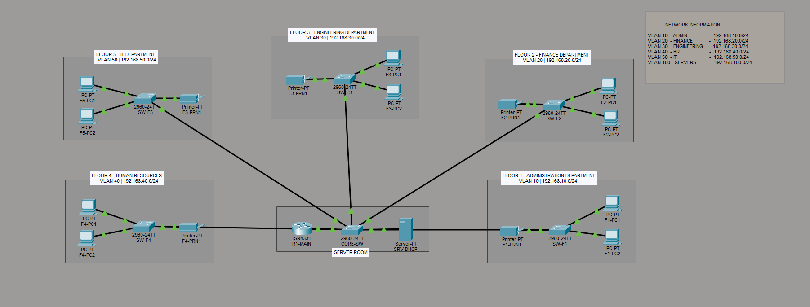
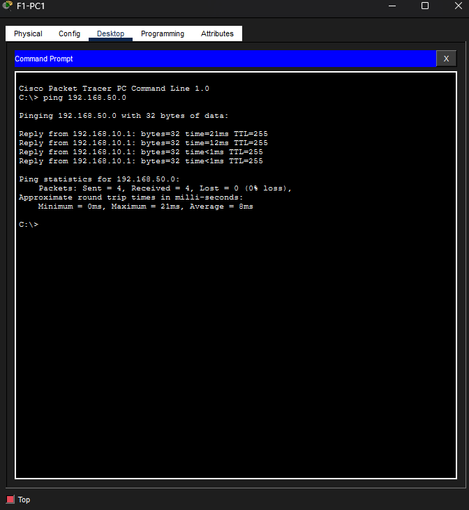
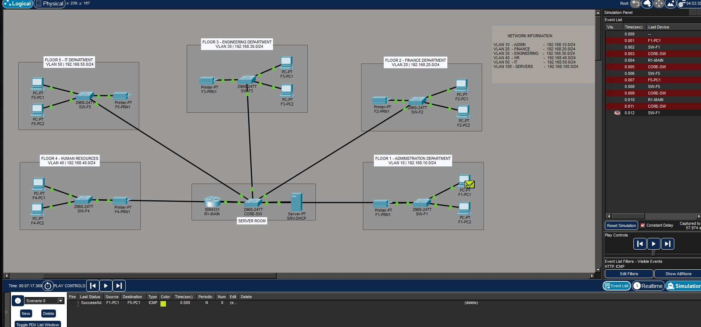
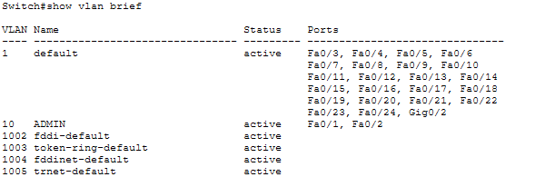
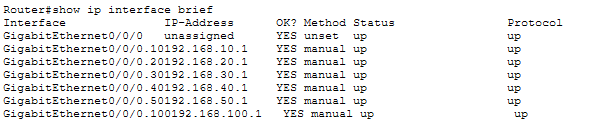
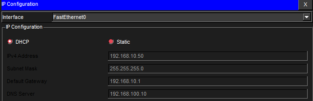

# 5-Story Client-Server Network Setup

## Overview
This project is an enterprise-style 5-story client-server network designed using Cisco Packet Tracer. The topology simulates a company environment with VLAN segmentation, inter-VLAN routing, DHCP implementation, and centralized network management.

---

## Features
- VLAN Segmentation
- Inter-VLAN Routing
- Router-on-a-Stick Configuration
- DHCP Configuration
- Department-Based Network Design
- Client-Server Architecture
- Printer Connectivity
- Simulation Mode Testing

---

## VLAN Structure

| Department | VLAN | Network |
|---|---|---|
| ADMIN | VLAN 10 | 192.168.10.0/24 |
| FINANCE | VLAN 20 | 192.168.20.0/24 |
| ENGINEERING | VLAN 30 | 192.168.30.0/24 |
| HR | VLAN 40 | 192.168.40.0/24 |
| IT | VLAN 50 | 192.168.50.0/24 |
| SERVERS | VLAN 100 | 192.168.100.0/24 |

---

## Topology

---

## Ping Test

---

## Simulation Test

---

## VLAN Configuration

---

## Router Subinterfaces

---

## DHCP Verification

---

## Devices Used
- Cisco Router
- Cisco Switches
- PCs
- Printers
- DHCP Server

---

## Software Used
- Cisco Packet Tracer

---

## Author
Eya
